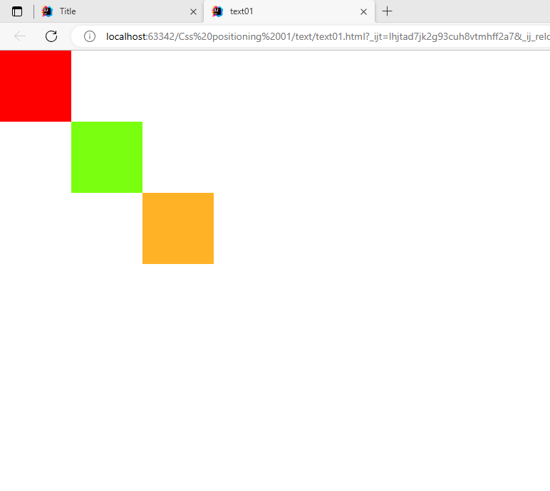

<h1>CSS Positioning</h1>

<a href="https://docs.google.com/document/d/15OE7T0dk59r62uscmlHvusS6v8a03dRPxja250q0eQQ/edit?usp=sharing">නොට් එක 🥷 </a>
<h2>In Class Text 01 (use relative)</h2>

<h2>CODE</h2>

    #div1{
      width: 100px;
      height: 100px;
      position: relative;
      background: red;
    }
    #div2{
      width: 100px;
      height: 100px;
      position: relative;
      left: 100px;
      background: #7aff11;
    }
    #div3{
      width: 100px;
      height: 100px;
      position: relative;
      left: 200px;
      background: rgba(255, 165, 0, 0.85);
    }
  

<h2>In Class Text 02 (use Absolute)</h2>

<h2>CODE</h2>

    #div1 {
            width: 500px;
            height: 500px;
            background: #00fbff;
            position: relative;
            top: 80px;
            left: 100px;

        }
        #div2 {
            width: 100px;
            height: 100px;
            background: red;
            position: absolute;

        } #div3 {
            width: 100px;
            height: 100px;
            background: red;
            position: absolute;
            left: 400px;

        } #div4 {
            width: 100px;
            height: 100px;
            background: red;
            position: absolute;
            bottom: 0px;
            right: 0px;

        } #div5 {
            width: 100px;
            height: 100px;
            background: red;
            position: absolute;
            bottom: 0px;
            left: 0px;

        }
        

            

            

            

            

        

